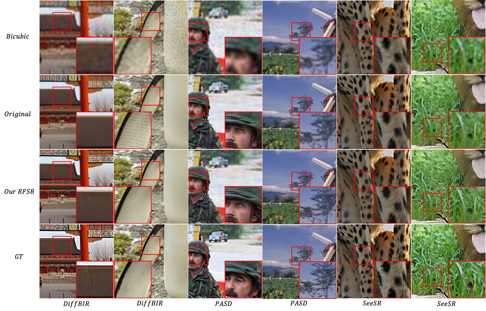
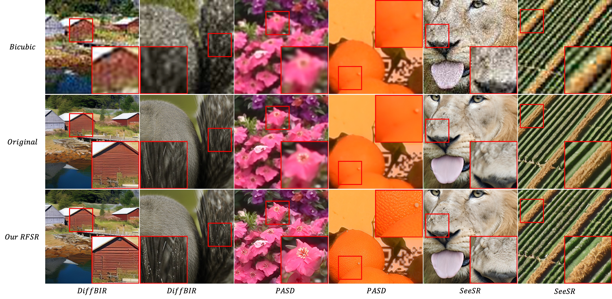
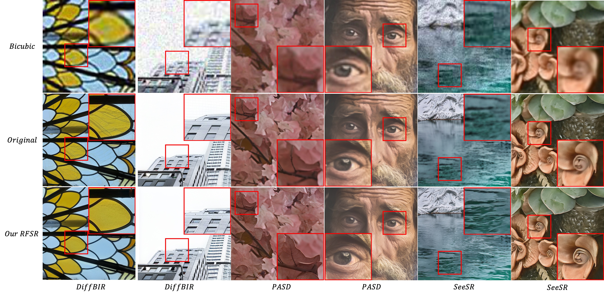
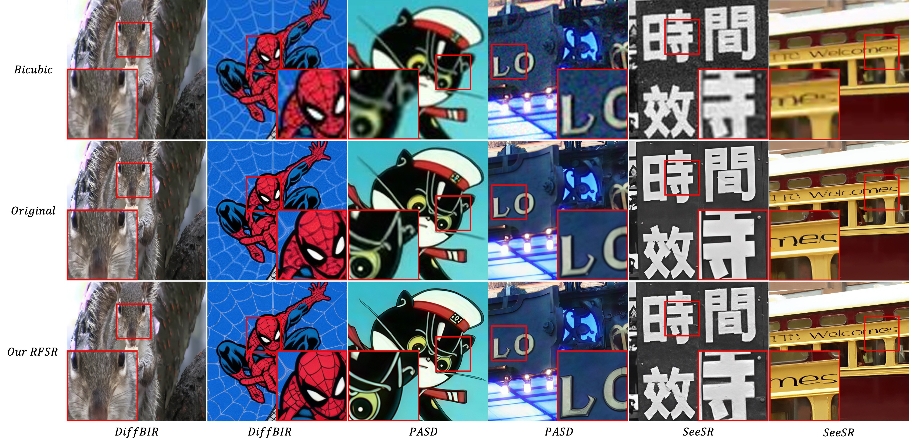
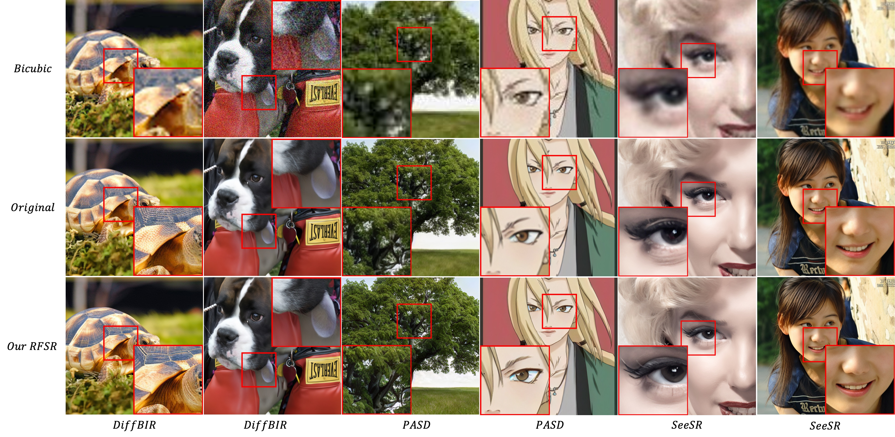

# RFSR

Codes for RFSR: Improving ISR Diffusion Models via Reward Feedback Learning.

We release example Reward Feedback Learning training code in SeeSR.

## Installation

To install the necessary dependencies, run the following commands:

```bash
pip install pyiqa
pip install image-reward
pip install git+https://github.com/fbcotter/pytorch_wavelets.git
```

## Run SeeSR

```bash
bash SeeSR/train_seesr_kl_ema.sh
```
## Visualization







## 🎓Citations
If our code helps your research or work, please consider citing our paper.
The following are BibTeX references:

```
@article{sun2024rfsr,
  title={RFSR: Improving ISR Diffusion Models via Reward Feedback Learning},
  author={Sun, Xiaopeng and Lin, Qinwei and Gao, Yu and Zhong, Yujie and Feng, Chengjian and Li, Dengjie and Zhao, Zheng and Hu, Jie and Ma, Lin},
  journal={arXiv preprint arXiv:2412.03268},
  year={2024}
}
```

## Acknowledgements

Visitor counter: 
